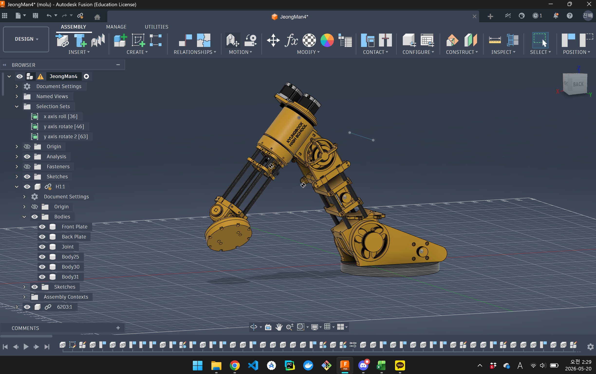
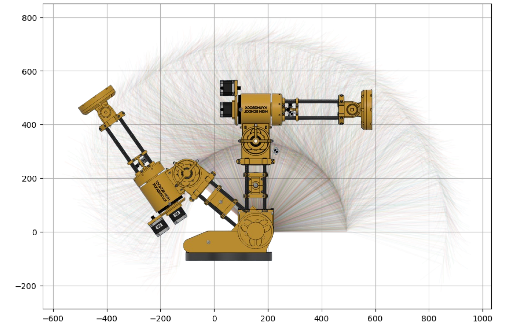
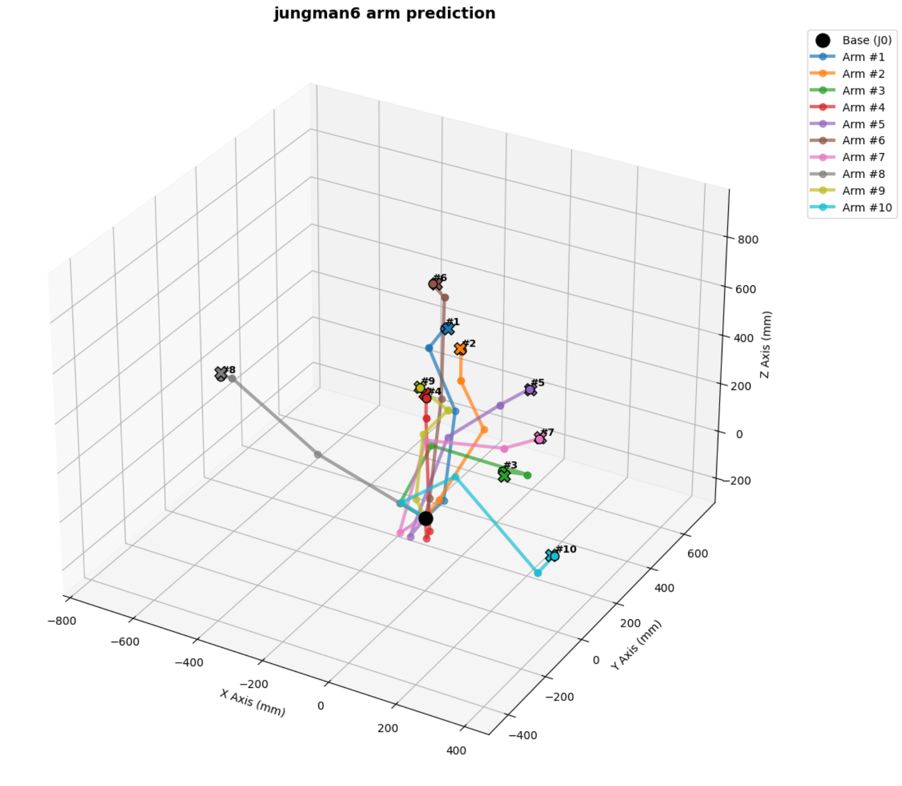
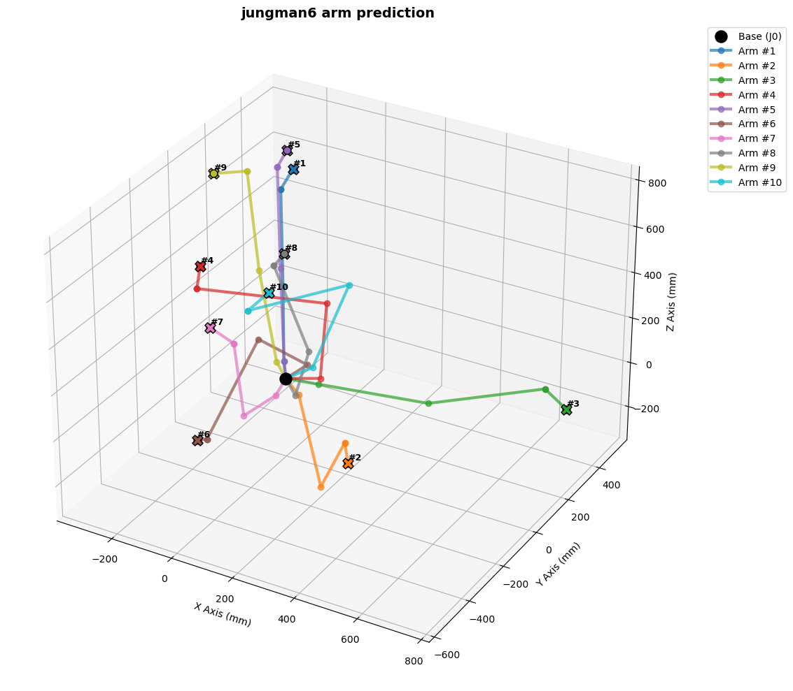
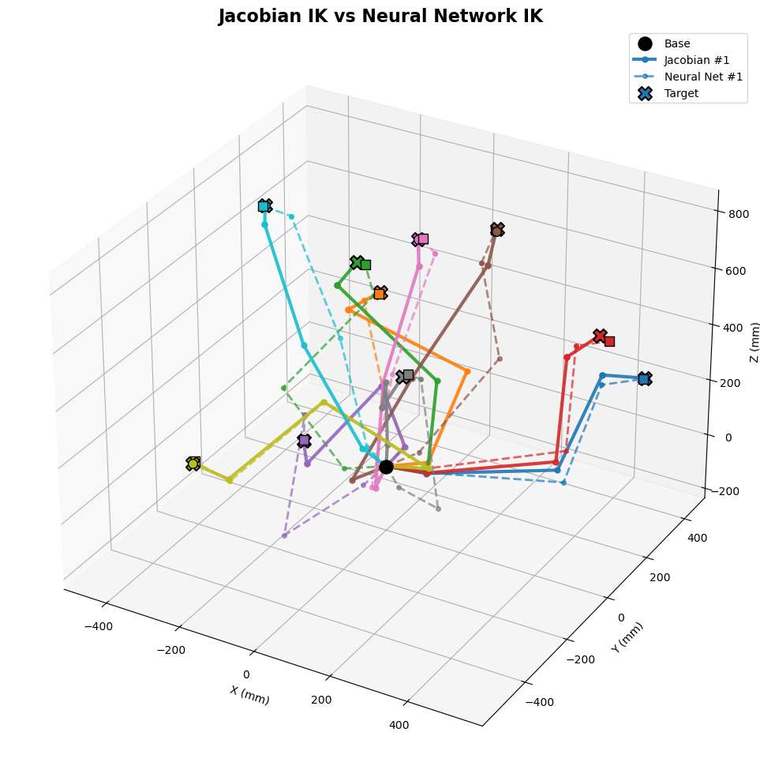

# JeongMan v6 Robotic-Arm

A 5dof robotic arm project developed for the annual academic festival at **Kyungbock High School**. This project covers everything from 3D CAD design and simulation to hardware implementation using an ESP32 and NEMA 23 stepper motors, enhanced by a PyTorch-based neural network and Jacobian-based numerical solvers for Inverse Kinematics.

---

## Project Overview

- **Institution**: Kyungbock High School
- **Event**: 2026 Academic Festival
- **Project Name**: jeongman v6 robot arm
- **Core Focus**: Integrating deep learning-based and mathematical numerical inverse kinematics with robust hardware using ESP32, NEMA 23 motors, and precise 3D-printed/CAD-designed structures.

---

## System Architecture & Design

### 1. 3D CAD Design (Fusion 360)

The structural components of the robot arm were meticulously designed using **Autodesk Fusion 360**, ensuring optimal weight distribution and structural integrity for the joints.

_Figure 1: 3D CAD modeling of the jeongman v6 robot arm_

### 2. Workspace & Reachability Analysis

We utilized **Python** to calculate the forward kinematics and visualize the robot's maximum reachable operational space.

_Figure 2: Simulated 3D workspace and coordinate reachability_

### 3. Inverse Kinematics (IK) Solvers

To find the precise joint angles ($\theta_0 \sim \theta_4$) required to reach target coordinates $(X, Y, Z)$, this project implements and evaluates two distinct approaches:

#### A. Deep Learning-Based Approach (PyTorch)

A **PyTorch-based neural network** was trained to predict accurate joint angles. This approach bypasses complex geometric calculations, ~~allowing for fast, real-time trajectory planning.~~

_Figure 3: Result of inverse kinematics prediction using Neural Network_

#### B. Differential Kinematics Approach (Jacobian Matrix)

To complement the neural network, we developed a mathematical solver using the **Jacobian matrix**. By calculating the linear and angular velocity relationships of the joints, this iterative numerical method solves the inverse kinematics with high geometric precision.

_Figure 4: Kinematics optimization and path tracking via Jacobian matrix_

### 4. Performance Comparison (NN vs. Jacobian)

We conducted a comparative analysis between the Neural Network and the Jacobian-based numerical solver. While the **Neural Network** ~~offers ultra-fast inference times suitable for dynamic environments~~, the **Jacobian solver** provides superior accuracy with minimal coordinate error, presenting a clear trade-off between computational speed and precision.

_Figure 5: Comparative analysis of accuracy and convergence between NN and Jacobian methods_

---

## Tech Stack & Hardware Specs

### Software & AI

- **CAD & Modeling**: Autodesk Fusion 360
- **AI & Kinematics**: Python, PyTorch, NumPy (Jacobian Solver)

### Hardware & Electronics

- **Main Controller**: ESP32 MCU
- **Actuators**: NEMA 23 Stepper Motors
- **Drivers**: DM556
- **Fabrication**: 3D Printing
